<h1 align="center"> Hey, I'm Felipe.</h1>

  <picture>
    <source media="(prefers-color-scheme: dark)" srcset="./assets/typing.svg" />
    
  </picture>

  I'm <b>Felipe Kummer</b>, a full-stack web developer from <b>Brazil</b>. 
  I mostly build with <b>Ruby</b> 💎 and I'm always learning something new.

  
  &nbsp;
  <a href="https://www.linkedin.com/in/felipe-kummer-dev/">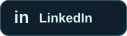</a>
  &nbsp;
  

  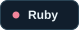
  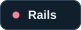
  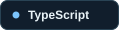
  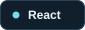
  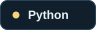
  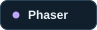

<h2 align="center">Stats overview 🌊</h2>

  <a href="https://github.com/FsKummer"></a>
  <a href="https://github.com/FsKummer?tab=repositories"></a>

  <a href="https://github.com/FsKummer"></a>

<h3 align="center">Achievements 🏆</h3>

  <a href="https://github.com/FsKummer"></a>

Public GitHub activity · Cards refreshed daily

---

  <b>Let's talk code, projects, or Pokémon.</b> 
  <a href="mailto:felipe.s.kummer@gmail.com">felipe.s.kummer@gmail.com</a>
  ·
  <a href="https://www.linkedin.com/in/felipe-kummer-dev/">LinkedIn</a>

Stay curious. Keep evolving. 🌊

